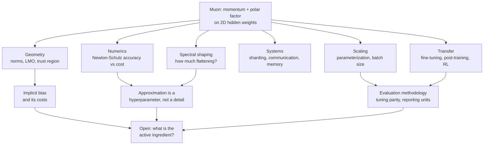

# The Muon Research Landscape

A synthesis of research on Muon and closely related matrix-aware, orthogonalized,
and spectral optimizers, written for a machine-learning researcher who knows AdamW
and SGD but has not followed this literature closely.

- **Last updated:** 2026-08-14
- **Research coverage through:** 2026-08-14
- **Companion index:** [../README.md](../README.md) holds the curated paper list
  organized by topic. This document holds the argument; the README holds the index.

Throughout, a distinction is maintained between what a paper *proves* (and under
what assumptions), what it *observes* (and in what setting), and what its authors
*propose* as an explanation. Where the literature disagrees, both positions are
stated along with the experimental differences that plausibly account for the gap.

---

## Executive Summary

**The idea.** Muon forms a momentum buffer from matrix-shaped gradients and steps
along that buffer's polar factor — the semi-orthogonal matrix obtained by setting
every singular value to 1 and keeping the singular vectors. The polar factor is
approximated by a handful of Newton–Schulz iterations, which cost only matrix
multiplications. In practice it is applied to two-dimensional hidden weights, with
AdamW handling everything else.

**Why it drew attention.** It arrived as a working recipe with speedrun records
rather than as a theory paper, it is cheap relative to full second-order methods,
and within months it had been scaled to a production mixture-of-experts and then to
a frontier-scale training run. That combination — simple, cheap, and demonstrably
scalable — is rare.

**The major transitions.** Four, roughly. First, from recipe to geometry: the update
was identified as steepest descent under a spectral norm, a linear minimization
oracle over a norm ball, a non-Euclidean trust region, and a nuclear-norm Lion-K
instance. Second, from geometry to systems: whole-matrix operations conflict with
parameter sharding, and a family of low-rank, block-periodic, tiled, sampled, and
ownership-based designs grew up to resolve it. Third, from "does orthogonalization
help?" to "how much spectral shaping, applied where?" — the question that now
organizes most new variants. Fourth, from pretraining to everything else:
fine-tuning, post-training, and other architectures and domains, where the answers
are markedly less uniform.

**The strongest current evidence.** Muon-family methods reliably reach a target
pretraining loss in fewer optimization steps than AdamW in a large number of
independently run settings, including studies where AdamW was tuned to the same
density. The method has been used in at least one frontier-scale run without
instability. Its optimizer state quantizes well. Several benefits reproduce outside
language modelling.

**The most important caveats.** The measured advantage shrinks as models grow — from
roughly 1.4× at 0.1B to 1.1× at 1.2B in the most carefully tuned study available.
The reporting unit varies wildly across papers (steps, tokens, FLOPs, wall-clock,
memory) and these are not interchangeable. Muon provably does not converge on
convex Lipschitz functions, nor on a class of stochastic problems for almost every
mini-batch size. An ablation that replaces the singular values with random noise
matched Muon at small scale. On a controlled low-rank factorization problem, the
advantage over tuned AdamW did not reproduce at all.

**The biggest open question.** Nobody has identified the active ingredient with
confidence. The spectral-geometry explanation is elegant and generative, but the
strongest direct tests of it — random-spectra ablations, component ablations on
grokking, and the matrix-whitening decomposition — each point somewhere else.

---

## 1. Origins: Momentum Meets Matrix Orthogonalization

Muon was introduced in late 2024 in [Keller Jordan's post](https://kellerjordan.github.io/posts/muon/),
validated through NanoGPT speedrun records rather than a paper. The construction is
short: take SGD with Nesterov momentum, but before applying the update, replace the
momentum matrix by an approximation to its polar factor computed with five
Newton–Schulz iterations in `bfloat16`. Apply this to hidden weight matrices only;
send embeddings, heads, gains, and biases to AdamW.

The motivation given was that the momentum buffer for a hidden layer is often
dominated by a few directions, so a plain SGD step moves the weights mostly along
those directions and barely at all along the rest. Orthogonalizing equalizes the
step's effect across singular directions.

Two strands of prior work make this less abrupt than it appears.

**Spectral geometry in optimization.** [Preconditioned Spectral Descent for Deep
Learning](https://papers.nips.cc/paper/5795-preconditioned-spectral-descent-for-deep-learning)
(NIPS 2015) already argued that steepest descent under Schatten-∞ geometry gives
tighter progress bounds than Frobenius geometry for certain model classes, and
already flagged the cost of the spectral step as the practical obstacle. On the
sign-based side, [The Geometry of Sign Gradient Descent](https://arxiv.org/abs/2002.08056)
(2020) built the framework of steepest descent under a norm and norm-smoothness, and
isolated the condition under which sign methods win: diagonally concentrated,
axis-aligned curvature. That condition is *coordinate-dependent*, which is exactly
the contrast later used to motivate rotation-invariant spectral geometry.

**Orthogonalizing gradients directly.** [Orthogonalising gradients to speed up
neural network optimisation](https://arxiv.org/abs/2202.07052) (2022) inserted an
orthogonalization step before an SGD update to diversify learned representations,
reporting reduced training time on ImageNet and CIFAR-10. This is the closest direct
predecessor; later trust-region work treats it as a special case and uses the
comparison to explain what Muon adds.

**Metrizing networks.** In parallel, [Scalable Optimization in the Modular
Norm](https://arxiv.org/abs/2405.14813) (NeurIPS 2024), [Old Optimizer, New Norm: An
Anthology](https://arxiv.org/abs/2409.20325) (OPT 2024 workshop), and [Modular
Duality in Deep Learning](https://arxiv.org/abs/2410.21265) (ICML 2025) developed a
vocabulary in which optimizer design decomposes into choosing a norm per tensor and
choosing a step size, with a duality map turning a gradient into an update. Muon is
the duality map for a linear layer under RMS→RMS operator norms. It is worth being
precise about the order of events: the framework and the algorithm developed
alongside each other, and the anthology paper explicitly disables exponential moving
averages to make its equivalences hold. It is a lens, not a derivation of the
deployed method.

---

## 2. From a Practical Trick to a Geometric Interpretation

Through 2025 the literature converged on several formulations. They are closely
related but *not* interchangeable, and confusing them causes real errors when
reading results.

**Norm-constrained steepest descent / LMO.** [Training Deep Learning Models with
Norm-Constrained LMOs](https://arxiv.org/abs/2502.07529) (ICML 2025) frames the
update as a linear minimization oracle over a norm ball. For the spectral norm, the
LMO solution is exactly the polar factor, which is why Muon appears as a special
case. The paper's own contribution, Scion, makes the norm choice explicit per layer
group and reports hyperparameter transfer across scale. This framing is *exact* for
the idealized update.

**Non-Euclidean trust region.** [Understanding Gradient Orthogonalization for Deep
Learning via Non-Euclidean Trust-Region Optimization](https://arxiv.org/abs/2503.12645)
(2025) recasts the same object as a first-order trust-region method under the
spectral norm, recovering Muon, normalized SGD, and signSGD-with-momentum as
instances and giving convergence rates in constrained, composite, non-convex, and
star-convex settings. This is a different derivation with different generalizations,
not a restatement.

**Implicit constraint via Lion-K.** [Muon Optimizes Under Spectral Norm
Constraints](https://arxiv.org/abs/2506.15054) (OPT 2025 workshop) shows Muon is
Lion-K instantiated with the nuclear norm, from which decoupled weight decay implies
that Muon is implicitly solving a *spectral-norm-constrained* problem. This is a
statement about what the method converges to, not about its per-step direction.

**Implicit bias.** [Implicit Bias of Spectral Descent and Muon on Multiclass
Separable Data](https://arxiv.org/abs/2502.04664) (NeurIPS 2025 Spotlight) proves
normalized steepest descent and its momentum variant converge to norm-specific
max-margin solutions, with Muon reaching the spectral-norm max-margin solution at an
O(1/√t) rate. [The Implicit Bias of Adam and Muon on Smooth Homogeneous Neural
Networks](https://arxiv.org/abs/2602.16340) (2026) extends this, showing Muon,
Signum, Adam, and hybrids converge to KKT points of margin problems posed in
*different* norms. Both results require linear separability and are proved for
linear or shallow models.

**Other lenses.** [Muon Dynamics as a Spectral Wasserstein Flow](https://arxiv.org/abs/2604.04891)
(2026) builds an optimal-transport framework where the trace norm recovers standard
W2 and the operator norm recovers Muon's geometry, with Schatten norms interpolating
— for an idealized, deterministic, continuous-time, infinite-width Muon.
[PolarGrad](https://arxiv.org/abs/2505.21799) separates *curvature* anisotropy, which
Adam addresses, from *gradient* anisotropy, which Muon addresses. [Muon as a Residual
Connection](https://arxiv.org/abs/2607.01124) offers a mechanistic reading in which
the update preserves information downstream layers can use, at the cost of fitting
the local objective more slowly.

**What is equivalent and what is merely related.** The LMO formulation and the
spectral-norm steepest-descent formulation are the same statement for the exact
polar factor. The trust-region formulation is an equivalent derivation of the same
step with a different analytical apparatus. The Lion-K/implicit-constraint result and
the implicit-bias results describe *asymptotic* behaviour and are not statements
about the step. The Wasserstein and residual-connection readings are interpretations
whose predictive content has not been tested at scale. Critically, essentially all
of them are derived for exact orthogonalization; §5 explains why that gap matters.

---

## 3. Scaling to Language-Model Pretraining

**The scaling result that mattered.** [Muon is Scalable for LLM
Training](https://arxiv.org/abs/2502.16982) (2025) made two changes: add weight
decay, and rescale the update by `0.2·sqrt(max(A, B))` so per-matrix update RMS
matches AdamW's. With those, it trained a 16B-total/3B-active mixture-of-experts on
5.7T tokens and reported matching AdamW's scaling-law curve at roughly 52% of the
training FLOPs. Two details govern how to read this: the headline unit is **FLOPs**,
not steps or wall-clock; and AdamW's hyperparameters were grid-searched and then
*reused* for Muon after RMS matching, so neither optimizer got a dedicated per-scale
sweep. That protocol is conservative for Muon's loss numbers but is not a symmetric
comparison.

**Batch size.** [Practical Efficiency of Muon for
Pretraining](https://arxiv.org/abs/2505.02222) (2025) argues the operative advantage
is that Muon degrades less in *data efficiency* as batch size grows past the critical
batch size, which converts into wall-clock savings under data parallelism. It pairs
Muon with muP and a multi-scale grid-refinement procedure to make hyperparameters
transfer, reaching 4B parameters. [Convergence Bound and Critical Batch Size of Muon
Optimizer](https://arxiv.org/abs/2507.01598) supplies the theoretical companion,
deriving a critical batch size that minimizes total computational cost and showing
how momentum and weight decay govern its scaling — while noting the single-matrix
analysis does not model layer-wise gradient heterogeneity, and that practice uses a
Muon+AdamW hybrid rather than the analyzed method. [Adaptive Batch Sizes Using
Non-Euclidean Gradient Noise Scales](https://arxiv.org/abs/2602.03001) derives noise
scales in the dual norms native to spectral and sign methods rather than reusing the
Euclidean version, reporting large step-count reductions at 160M.

**Parameterization.** [Optimal Scaling Needs Optimal Norm](https://arxiv.org/abs/2510.03871)
finds that the jointly optimal learning rate and batch size across scales are pinned
to one invariant — the operator norm of the output layer — across more than 2,000
runs. [Rethinking Language Model Scaling under Transferable Hypersphere
Optimization](https://arxiv.org/abs/2603.28743) and [Controlled LLM Training on
Spectral Sphere](https://arxiv.org/abs/2601.08393) both constrain weight norms
directly so that a single small-scale tuning run transfers across width, depth,
token budget, and MoE granularity. [Fantastic Pretraining Optimizers II: Hyperball
Optimization](https://arxiv.org/abs/2606.16899) goes further, arguing Muon's
advantage erodes at scale *because of how decoupled weight decay controls weight
norms*, and replacing that mechanism with a per-matrix hard norm constraint.

**The comparison problem.** Two results should be read together. [Hyperparameter
Transfer Enables Consistent Gains of Matrix-Preconditioned Optimizers Across
Scales](https://openreview.net/forum?id=Ei6IsmxYrb) (NeurIPS 2025) reports that
matrix methods hold a consistent compute-matched speedup over AdamW *provided*
hyperparameters are transferred with the right scaling rules — and that the speedup
degrades when they are not. [Fantastic Pretraining Optimizers and Where to Find
Them](https://arxiv.org/abs/2509.02046) gives every optimizer, AdamW included, an
identical two-phase coordinate-descent budget and finds the matrix-method advantage
falls from ~1.4× at 0.1B to ~1.1× at 1.2B. These are not contradictory: one says
scaling rules recover the gain, the other says the gain shrinks with scale under
equal tuning. Both agree that *tuning protocol is a first-order variable* and that
reported speedups from papers which did not tune AdamW symmetrically should be
discounted. Both also stop below 1.5B parameters.

**Frontier scale.** The largest published datapoint is [Kimi
K2](https://arxiv.org/abs/2507.20534), which introduced MuonClip — Muon plus
QK-clipping — and reported 15.5T tokens without loss spikes. This is a system report,
not a controlled comparison; it establishes that the method is *usable* at that scale,
not that it is better there.

---

## 4. How Much Spectral Flattening Is Actually Needed?

This is the most consequential shift in the literature, and it deserves to be stated
as a change of question rather than a change of method. The 2024–2025 question was:

> Does orthogonalizing momentum help?

The 2026 question is:

> *What* spectral transformation should be applied, *by how much*, to *which* matrix,
> at *which stage* of training?

**The theoretical anchor.** [Isotropic Curvature Model for Understanding Deep
Learning Optimization: Is Gradient Orthogonalization Optimal?](https://arxiv.org/abs/2511.00674)
(2025) works in a convex model with isotropic curvature and finds that the optimal
update *does* flatten singular values — but that *full* flattening is optimal only
past a curvature phase transition. Muon is directionally right and not strictly
optimal. This is the cleanest statement of why the field moved.

**Fractional and partial transforms.** [Delving into Muon and
Beyond](https://arxiv.org/abs/2602.04669) recasts Muon as the `p = 0` member of a
family `U Σ^p Vᵀ` and adds `p = 1/2` and `p = 1/4` computable by coupled
Newton–Schulz without an SVD; its controlled comparisons conclude Muon behaves as a
spectral *normalizer* rather than a strictly better optimizer, and that it
underperforms Adam once applied to second-moment-normalized updates.
[PowerMuon](https://arxiv.org/abs/2606.13867) develops the fractional-power idea
rigorously, proving no fixed univariate polynomial iteration can realize `σ → σ^p`
and supplying bivariate recurrences that can — then reports the result honestly:
PowerMuon is *worse* than Muon when pretraining from random initialization, with gains
appearing only in fine-tuning. That regime split is itself an important finding.
[MuCon](https://arxiv.org/abs/2605.26459) clips singular values at a threshold rather
than flattening them, and concludes cautiously that the clipping primitive is
ill-conditioned when many values sit near the threshold.
[NuMuon](https://arxiv.org/abs/2603.03597) shrinks singular values under a
nuclear-norm constraint instead, targeting downstream compressibility.
[An Isotropy-Preserving Spectral Cap](https://arxiv.org/abs/2607.19771) caps only the
top direction. [Pion](https://arxiv.org/abs/2605.12492) goes to the other extreme,
using multiplicative orthogonal equivalence transformations that hold the spectrum
*fixed* rather than reshaping it at all.

**Weighted and data-dependent geometries.** [Second-Order Muon Done
Right](https://arxiv.org/abs/2608.09763) observes that the polar update solves the
*unweighted* spectral oracle exactly, and generalizes to a weighted oracle whose
exact solution remains available for any positive-definite left and right maps —
with the maps refreshed lazily to amortize cost.
[Mousse](https://arxiv.org/abs/2603.09697) runs the spectral step inside a
Kronecker-factored whitened frame. [The Newton-Muon
Optimizer](https://arxiv.org/abs/2604.01472) shows standard Muon is the case that
drops right-preconditioning, and adds it back via inverse input second moments.
[MALT](https://arxiv.org/abs/2608.05088) conjugates the momentum by row- and
column-wise diagonal preconditioners around the Newton–Schulz step.

**Row-, neuron-, and layer-aware normalization.** [NorMuon](https://arxiv.org/abs/2510.05491)
observes that orthogonalized updates still have highly non-uniform per-neuron row
norms and normalizes rows *after* orthogonalization.
[Aurora](https://arxiv.org/abs/2606.27715) makes the sharper point that naive row
normalization drifts off the polar factor, and instead solves semi-orthogonality and
equal-row-norms jointly. [Muown](https://arxiv.org/abs/2605.10797) promotes row
magnitude to explicit optimizer state under ℓ∞ geometry.
[MuonEq](https://arxiv.org/abs/2603.28254) rescales rows and columns *before* the
iteration, arguing finite-step orthogonalization quality is governed by the input's
conditioning.

**Second-moment information.** [AdaMuon](https://arxiv.org/abs/2507.11005),
[Muon²](https://arxiv.org/abs/2604.09967), [Adam Improves
Muon](https://arxiv.org/abs/2602.17080), and [Variance-Adaptive
Muon](https://arxiv.org/abs/2601.14603) all add Adam-style second-moment scaling,
differing mainly in whether it is applied before or after orthogonalization and
whether it is scalar, row-wise, or element-wise. Muon² reports the useful side effect
that better-conditioned input allows substantially fewer Newton–Schulz iterations.

**Hybrids.** [COSMOS](https://arxiv.org/abs/2502.17410) splits the eigenspace between
SOAP and Muon. [MiMuon](https://arxiv.org/abs/2605.19619) mixes Muon with momentum
SGD to tighten a generalization bound. [A River-Valley
Perspective](https://arxiv.org/abs/2606.21514) recommends switching to a
gradient-descent-like refiner near convergence.

**The decisive ablation.** [What Really Matters in Matrix-Whitening
Optimizers?](https://arxiv.org/abs/2510.25000) decomposes the family into spectral
normalization and variance adaptation and, under symmetric per-optimizer tuning,
finds the variance-adaptation half — which Muon omits entirely — explains more of the
gain over Adam than spectral accuracy does. The absolute effect is small (~0.04
validation loss at 162M) and the study is one architecture at one scale, but it is
the most direct attempt to attribute the gain to a component, and it does not
attribute it to orthogonalization.

---

## 5. Orthogonalization Accuracy Versus Computational Cost

**The standard iteration.** Five Newton–Schulz steps with quintic coefficients
`(3.4445, −4.7750, 2.0315)` in `bfloat16` is the de-facto default across the
reference implementation, Moonshot's, PyTorch's, and Keras's. This does not compute
the polar factor accurately; it lands the singular values loosely near 1.

**Better polynomials.** [The Polar Express](https://arxiv.org/abs/2505.16932) (ICLR
2026 Oral) derives a provably optimal iteration-varying polynomial by solving a
minimax problem at each step, with explicit attention to `bfloat16` execution.
[Chebyshev-type polynomials](https://arxiv.org/abs/2506.10935) derive coefficients
via the alternance theorem and a Remez procedure.
[Turbo-Muon](https://arxiv.org/abs/2512.04632) supplies a better initial guess so one
iteration can be dropped. [IFNSO](https://arxiv.org/abs/2602.02500) collapses the
iteration into a single fitted polynomial. NVIDIA's `emerging_optimizers` now ships
eight coefficient families as a configuration option, which is a fair indication of
how unsettled the choice is.

**Does accuracy help?** This is where the section becomes interesting. [How Much
Orthogonalization Does Muon Need?](https://arxiv.org/abs/2606.00371) builds a
deliberately *worse* polar solver — an adaptive degree-3 schedule aiming only to land
the spectrum in a loose [0.7, 1.3] band — and uses it to show that training quality
does not track polar-decomposition accuracy. The author explicitly declines to claim
the cheaper map is a better update, and reports that the largest model tested is
marginally worse. Read together with the matrix-whitening ablation in §4 and the
random-spectra result in §10, the accumulating picture is that the *precise* spectral
shape matters much less than the fact that some flattening happens.

**The iteration count is a hyperparameter.** [Beyond the Ideal: Analyzing the Inexact
Muon Update](https://arxiv.org/abs/2510.19933) is the first analysis of the
approximate update actually deployed, and its central practical finding is that the
Newton–Schulz iteration count must be co-tuned with the learning rate and momentum.
This has a direct consequence for reading the rest of the literature: results
comparing variants at a fixed iteration count are confounded, and results from theory
papers assuming exact orthogonalization do not transfer without argument.

**Rectangular and ill-conditioned matrices.** The polar factor of an `m × n` matrix
is semi-orthogonal, not orthogonal, and every implementation scales the update by a
function of the aspect ratio. [Iterative Orthogonalization Scaling
Laws](https://arxiv.org/abs/2505.04005) argued early that the iteration degrades as
matrices grow because random-matrix singular values shrink. [Spectral Scaling Laws of
Muon](https://arxiv.org/abs/2606.04058) puts numbers on the concern: momentum
singular-value quantiles settle after a burn-in to layer- and size-dependent values
obeying power laws in model size, and some late layers scale steeply enough to
project into a Newton–Schulz failure regime at frontier scale. That is an
extrapolation from a 77M–2.8B fit, mitigable by more iterations or better
coefficients — but it is the clearest reason to expect the current default to need
revisiting as models grow.

**Structured alternatives.** [Hierarchical Muon](https://arxiv.org/abs/2606.27216)
applies the map tile-wise, and is admirably explicit that for a finite tile count
this is a *different local map*, not a convergent approximation.
[MUD](https://arxiv.org/abs/2603.17970) swaps the polar iteration for triangular
Cholesky-style whitening, accepting a worse direction for much lower overhead — an
advantage that is therefore hardware- and shape-dependent.
[TEON](https://arxiv.org/abs/2601.23261) and
[Tensorion](https://arxiv.org/abs/2606.25975) go the other way, orthogonalizing
across layers or tensor modes jointly. [Tri Dao's Gram
Newton-Schulz](https://tridao.me/blog/2026/gram-newton-schulz/) iterates on the
smaller symmetric Gram matrix, with hardware-aware analysis; DeepSpeed exposes a
Gram-based variant as a configuration option.

---

## 6. Distributed Systems, Communication, and Sharding

**The structural problem.** AdamW's update is element-wise, so it is indifferent to
how parameters are sharded. Muon's is not: the polar factor of a matrix cannot be
computed from a slice of that matrix. Under ZeRO-2/3 or FSDP the optimizer sees only
a shard, so a naive implementation must gather each matrix, orthogonalize it, and
scatter the result — adding a collective to every optimizer step and often
re-materializing full parameters that sharding existed to avoid.

**Approaches that have been tried.**

- *Low-rank momentum with error feedback.* [Dion](https://arxiv.org/abs/2504.05295)
  replaces Newton–Schulz with amortized power iteration over a low-rank momentum
  buffer, so orthonormalized updates compose with sharded weights. Quality depends on
  the rank fraction. [Dion2](https://arxiv.org/abs/2512.16928) simplifies this to
  random row/column sampling, running the iteration on a sub-block.
  [Orth-Dion](https://arxiv.org/abs/2605.16341) attacks the same family from the
  geometry side, arguing that column normalization does not yield the rank-r polar
  factor and that replacing it with QR orthogonalization of the right factor removes
  a sqrt(r) penalty in the rate.
- *Block-periodic and blockwise orthogonalization.*
  [MuonBP](https://arxiv.org/abs/2510.16981) orthogonalizes per-device shards
  independently most steps and does a full orthogonalization periodically, with two
  stepsizes. Megatron-Core's `blockwise` tensor-parallel mode is the same trade made
  as a configuration option: no collectives, approximate orthogonalization.
- *Ownership placement.* [MatrixFSDP](https://arxiv.org/abs/2607.05895) deliberately
  unbalances the shards so exactly one rank owns each 2D weight in full and its peers
  hold empty shards. The routine backward reduction then delivers Muon's input
  locally and the optimizer step needs no collective at all. The catch is that the
  owner's fanout becomes the next bottleneck under strong scaling, and parameters
  already fragmented by tensor parallelism are out of scope.
- *Compression.* [SignMuon](https://arxiv.org/abs/2605.16311) transmits one bit per
  coordinate and combines by majority vote. [Error Feedback for Muon and
  Friends](https://arxiv.org/abs/2510.00643) gives the first distributed
  linear-minimization-oracle method with convergence guarantees under bidirectional
  compression.
- *Low-communication and federated regimes.*
  [MuLoCo](https://arxiv.org/abs/2505.23725) uses Muon as DiLoCo's inner optimizer.
  Three independent papers named *FedMuon*
  ([Takezawa et al.](https://arxiv.org/abs/2509.26337),
  [Zhang & Gao](https://arxiv.org/abs/2510.03866),
  [Liu et al.](https://arxiv.org/abs/2510.27403)) address federated settings; the
  first proves naive Muon-in-FedAvg cannot converge because the LMO is nonlinear.
  [DeMuon](https://arxiv.org/abs/2510.01377) extends to decentralized graphs.
- *Engineering.* [DMuon](https://arxiv.org/abs/2606.27153) is a pure systems paper
  reporting 1.48–3.01× end-to-end step-time improvements from 8 to 256 GPUs with
  near-AdamW overhead.

**Reading systems papers carefully.** These papers split into two kinds that are easy
to conflate. Some measure *optimization* — loss against steps or tokens. Some measure
*systems* — step latency, throughput, memory per rank, bytes on the wire. A paper
reporting a 3× step-time improvement with no quality comparison (DMuon) and a paper
reporting fewer steps to target loss with no wall-clock accounting (several variant
papers) are making incomparable claims. MatrixFSDP handles this well by pairing its
latency numbers with an exact-match check against a DDP reference; that is the right
pattern, and it is not yet the norm.

**Where the implementations actually are.** As of August 2026, three ecosystems do
real optimizer-level sharding: DeepSpeed (ZeRO stages 1–3), Megatron-Core
(layer-wise data-parallel assignment plus three tensor-parallel modes), and
`microsoft/dion` (DTensor, FSDP2). `torch.optim.Muon` is single-device only, which is
the stated reason torchtitan's Muon feature request was closed. See
[Implementations and Ecosystem](../README.md#implementations-and-ecosystem).

---

## 7. Quantization and Memory-Efficient Muon

Muon carries one momentum buffer per eligible matrix — half AdamW's optimizer state
— so it starts from a memory advantage. The research question is how much further it
compresses.

**Low-bit state.** [Effective Quantization of Muon Optimizer
States](https://arxiv.org/abs/2509.23106) shows blockwise 8-bit quantization is
essentially lossless, and argues Muon is *structurally* friendlier to quantization
than AdamW because a plain linear scheme suffices where AdamW needs dynamic scaling.
The gains are in optimizer-state footprint only; no wall-clock speedup is claimed.
Note that this paper was substantially revised — its later version changed both the
experimental scale and the headline reduction figure — so entries written against v1
misstate it. [MuonQ](https://arxiv.org/abs/2605.11396) (COLM 2026) pushes to 4 bits by
protecting singular-vector *directions* through a power-iteration decomposition,
which is the right instinct: what matters for an orthogonalized update is direction,
not magnitude fidelity.

**Theory.** [A Convergence Analysis of Adaptive Optimizers under Floating-point
Quantization](https://arxiv.org/abs/2510.21314) finds Muon needs weaker
quantization-error control than Adam, whose bound degrades as the second-moment decay
approaches one.

**Low-rank optimizer state.** [LiMuon](https://arxiv.org/abs/2509.14562) replaces the
momentum matrix with a randomized-SVD low-rank factorization plus variance reduction;
its guarantee rests on a nonstandard assumption bounding tail singular values by the
gradient norm, and the authors state the empirical results do not reach state of the
art. [Low-rank Orthogonalization](https://arxiv.org/abs/2509.11983) orthogonalizes
only the low-rank part. [SUMO](https://arxiv.org/abs/2505.24749) uses exact SVD inside
an adapted subspace. [GUM](https://arxiv.org/abs/2510.17802) makes low-rank projection
unbiased by combining it with layerwise sampling.

**Interaction with model quantization.** [Outlier-Safe
Pre-Training](https://arxiv.org/abs/2506.19697) uses Muon plus single-scale
normalization to prevent activation outliers forming during pretraining at all,
arguing outliers are a training-strategy artefact rather than intrinsic to
transformers — which, if it holds up, is a more interesting claim about Muon than any
loss-curve result. [Beyond Outliers](https://arxiv.org/abs/2509.23500) tempers this,
finding across six optimizers that standard outlier metrics fail to predict
post-training-quantization outcomes.

**Communication implications.** Low-bit and low-rank state reduce what has to move
between ranks, so this section and §6 are coupled: Dion's low-rank buffer, SignMuon's
one-bit transmission, and 8-bit state all attack the same budget from different
directions.

---

## 8. Fine-Tuning, Post-Training, and Optimizer Transfer

The cleanest negative-transfer result in the literature lives here.

**The mismatch.** [Can Muon Fine-tune Adam-Pretrained
Models?](https://arxiv.org/abs/2605.10468) (2026) diagnoses why switching an
Adam-pretrained checkpoint to Muon degrades performance: the two optimizers carry
different implicit biases, and the resulting update disturbs pretrained knowledge in
proportion to its magnitude. The remedy that works is to shrink the update — LoRA
largely closes the gap. Two caveats: the symmetric Muon-pretrained control is only
561M for compute reasons, and mismatch severity varies by task with no explanatory
factor identified.

**Where flattening actively hurts.** [Rethinking Muon Beyond
Pretraining](https://arxiv.org/abs/2605.19282) identifies vision-language-action
training and reinforcement learning with verifiable rewards as regimes where sending
*every* singular value to 1 is the wrong operation, because it amplifies noise
directions along with signal, and proposes a promote-then-suppress high-pass filter
instead. This is the sharpest statement that the pretraining answer does not transfer.

**Scale mismatch and stability.** [REG](https://arxiv.org/abs/2510.03691) argues the
matrix-sign operator is too aggressive for fine-tuning and substitutes a gentler
row-and-column scaling grounded in matrix equilibration, explicitly targeting
AdamW-checkpoint compatibility. Its authors are candid that a convergence proof for
the full algorithm is open and that their empirically best norm choice contradicts
classical numerical-linear-algebra expectations.

**Parameter-efficient tuning.** [LoRA-Muon](https://arxiv.org/abs/2606.12921)
rederives the spectral steepest-descent rule for the geometry of factored updates
rather than applying matrix Muon to the factors, yielding learning-rate transfer
across rank, width, and depth and avoiding QR factorization and second-moment state.
[JAGUAR Muon](https://arxiv.org/abs/2506.04430) brings matrix structure into
zeroth-order fine-tuning. [POME](https://arxiv.org/abs/2510.06627) applies a
Muon-style truncated-SVD projection to the fine-tuned-minus-pretrained delta *after*
training — a use of the operator outside the optimizer loop entirely.

**Reinforcement learning.** [When Does Muon Help Agentic
Reinforcement Learning?](https://arxiv.org/abs/2607.16169) finds the answer depends
jointly on the advantage estimator and the learning rate, with results that are
single-seed at 0.5B on one benchmark. NVIDIA's own NeMo-RL documentation reports only
minor gains over Adam when post-training Adam-pretrained models. The honest summary is
that RL evidence is thin and the sign of the effect is not established.

**Does the pretraining conclusion transfer?** On current evidence, not by default.
The transfer failures have a consistent shape — they involve either an optimizer-state
and implicit-bias mismatch at the switch point, or a regime where uniform flattening
is the wrong spectral operation. Both are addressable, and both mean pretraining
results should not be cited as fine-tuning results.

---

## 9. Applications Beyond Standard LLM Pretraining

Results outside language-model pretraining are mostly positive but frequently
*localized* — to particular layers, particular training recipes, or particular
spectral regimes. That localization is more informative than the headline numbers.

**Vision transformers.** [Muon in Vision
Transformers](https://arxiv.org/abs/2605.24770) is the most careful study here, and
its central finding is a confound the rest of the literature mostly ignores: the
advantage over AdamW *grows with aggressive data augmentation*. It is not
recipe-neutral. Removing heavy augmentation induces mode collapse in deep MLP-down
gradients. [Sharpness-Aware Minimization and Muon](https://arxiv.org/abs/2607.26001)
makes both SAM stages matrix-aware on ImageNet-1K.

**Diffusion transformers.** [CMuon](https://arxiv.org/abs/2608.02502) (ECCV 2026)
identifies that DiT weight tensors fuse semantically distinct projections into one
matrix, so whole-matrix orthogonalization mixes unrelated subspaces, and repairs it by
chunking. The benefit is therefore contingent on the chunk partition matching the
architecture's semantic blocks — a good example of a localized mechanism.

**State-space models.** [Muon Meets Mamba](https://arxiv.org/abs/2608.03941) asks
which matrices inside an SSM benefit and finds output-projection-only application
beats input-projection-only — then reports that improved conditioning does *not*
explain the difference, leaving the mechanism open. [MuonSSM](https://arxiv.org/abs/2606.30461)
(ICML 2026 Oral) takes a different route entirely, moving Newton–Schulz out of the
optimizer and into the architecture.

**Recommendation and tabular data.** [MuonRec](https://arxiv.org/abs/2603.00416)
reports fewer converged steps and better ranking quality on generative
recommendation, though on datasets small relative to the 0.5B–3B backbones and with
no wall-clock accounting. [Benchmarking Optimizers for MLPs in Tabular Deep
Learning](https://arxiv.org/abs/2604.15297) is stronger evidence — fifteen optimizers
across seventeen datasets under one protocol — and lands on Muon as the reliable
choice, conditioned explicitly on the overhead being affordable.

**Scientific machine learning.** [Muon with Spectral
Guidance](https://arxiv.org/abs/2602.16167) targets physics-informed networks and PDE
benchmarks at small scale. [Optimization Benchmark for Diffusion Models on Dynamical
Systems](https://arxiv.org/abs/2510.19376) tunes each optimizer separately on a
23M-parameter Navier–Stokes denoiser and finds Muon and SOAP clearly better than
AdamW — while reporting that Muon costs 1.45× AdamW per step, and controlling for it
by giving AdamW extended training. [Beyond Adam: SOAP and Muon for
MLIPs](https://arxiv.org/abs/2607.02499) is the counterweight: on neural interatomic
potentials, Muon's benefit is narrower and less consistent than SOAP's.

**Adversarial and robust training.** [When Muon Optimizer Meets Adversarial
Training](https://arxiv.org/abs/2605.26929) finds gains are architecture-dependent,
competitive with rather than better than SGD on convolutional networks, with SGD
better on ImageNet and clear wins mainly over AdamW. That is a useful reminder that
"beats AdamW" and "is the best available optimizer" are different claims.

**Controlled theoretical models.** Matrix factorization has become the field's
preferred controlled testbed, and it has produced results in both directions:
[balanced solutions without slow saddle-to-saddle
dynamics](https://arxiv.org/abs/2606.30509) and [condition-number-independent
iteration complexity](https://arxiv.org/abs/2601.13474) on the positive side,
[Reassessing Muon for Matrix Factorization](https://arxiv.org/abs/2607.13246) on the
negative. Associative-memory models have likewise produced [capacity
separations](https://arxiv.org/abs/2603.26554) and [tail-class
advantages](https://arxiv.org/abs/2509.26030).

**A caution.** "Muon worked in domain X" is weak evidence for general superiority,
particularly when X was evaluated at one scale with one architecture against a
baseline that may not have been tuned to the same density. The application papers
that carry the most weight are the ones that identify *which layers* or *which
regime* the benefit comes from, because those claims are falsifiable.

---

## 10. Critical Results and Limitations

Negative and mixed findings are not a footnote to this literature; several of them
are among its most informative results.

**Theorem-grade non-convergence.** [Muon Does Not Converge on Convex Lipschitz
Functions](https://arxiv.org/abs/2605.08980) constructs explicit counterexamples
showing that no learning-rate schedule makes Muon converge on convex Lipschitz
functions, exploiting the fact that on diagonal/separable functions Muon reduces to
signed momentum. Error feedback provably repairs convergence — and the authors then
show empirically, on WideResNet/CIFAR-10 and nanoGPT/FineWeb-Edu, that the
theoretically correct fix makes training *worse*. Their own conclusion is the right
one: the convex Lipschitz class is the wrong lens, and Muon's practical success
plausibly rests on smoothness structure absent from it. Independently, [On MUON
optimization: from non-convergence to an error
analysis](https://arxiv.org/abs/2608.04607) proves Muon fails to converge on a simple
class of stochastic problems as steps grow, for almost every mini-batch size, while
supplying an error analysis for generalized Newton–Schulz variants.

**The active-ingredient problem.** [Muon is Not That Special: Random or Inverted
Spectra Work Just as Well](https://arxiv.org/abs/2605.11181) exhibits an optimizer
that discards the singular values entirely and substitutes random noise, and finds it
matches Muon at 124M on WikiText-2 — arguing the real drivers are gradient alignment
and step-size optimality rather than the spectral geometry. [The Active Ingredient in
Muon's Grokking](https://arxiv.org/abs/2607.20512) ablates components on modular
arithmetic and finds orthogonalization carries the effect while spectral scaling
alone is no faster than AdamW. [What Really Matters in Matrix-Whitening
Optimizers?](https://arxiv.org/abs/2510.25000) attributes more of the gain to variance
adaptation than to spectral normalization. Three different methodologies, three
results that do not support the geometric explanation as *the* mechanism. All three
are small-scale, which is the obvious rejoinder — but the burden has shifted.

**Tuning and evaluation artefacts.** [Fantastic Pretraining Optimizers and Where to
Find Them](https://arxiv.org/abs/2509.02046) is the reference here: under equal-density
coordinate-descent tuning for every optimizer including AdamW, the matrix-method
advantage falls from ~1.4× at 0.1B to ~1.1× at 1.2B, and ranking optimizers by loss
early in training misorders them relative to end-of-run loss. [Benchmarking Optimizers
for LLM Pretraining](https://arxiv.org/abs/2509.01440) adds that the learning-rate
decay floor alone reshuffles rankings, and that vanilla Muon is weak at small batch
sizes where its weight-decayed variant is robust. [A Minimalist Optimizer
Design](https://arxiv.org/abs/2506.16659) asks how much machinery is needed at all and
reports that column-normalized SGD with last-layer momentum matches Muon and Adam at
35–45% of Adam's memory.

**Failure to reproduce on controlled problems.** [Reassessing Muon for Matrix
Factorization](https://arxiv.org/abs/2607.13246) strips away scale, architecture, and
data confounds and reports that Muon does not consistently outperform a tuned AdamW
there, with several previously reported advantages sensitive to hyperparameter
choices.

**Late-training degradation.** [A River-Valley
Perspective](https://arxiv.org/abs/2606.21514) proves that near the valley floor Muon
progresses more slowly than gradient descent and is prone to overshoot and oscillation
because the orthogonalized update discards residual scale, and recommends switching
optimizers near convergence. [Post-Grokking
Collapse](https://arxiv.org/abs/2608.07436) documents that Muon-trained transformers
which have already generalized subsequently *lose* that generalization under continued
training in all nine configurations tested, localized to the embedding/readout
interface. [Muon learns balanced solutions...](https://arxiv.org/abs/2606.30509) notes
independently that a constant learning rate causes indefinite oscillation around the
solution manifold.

**Implicit-bias concerns.** [To Use or not to Use Muon: How Simplicity Bias in
Optimizers Matters](https://arxiv.org/abs/2603.00742) argues Muon buys speed by
flattening the sequential low-rank-first learning order that gradient descent
exhibits — and that this forfeits simplicity bias, so the model can latch onto
spurious features and fail to share structure across tasks. This is the most direct
statement of a *cost* to the mechanism everyone else is describing as a benefit. The
theorems are gradient-flow results for two-layer linear networks. Relatedly, [The
Spectral Dynamics and Noise Geometry of Muon](https://arxiv.org/abs/2606.08388)
falsifies the common nuclear-norm/low-rank interpretation, argues the bias is toward a
flat, maximum-entropy spectrum instead, and reports a small vision control in which
the optimizer ranking *reverses*.

**Numerical concerns at scale.** [Spectral Scaling Laws of
Muon](https://arxiv.org/abs/2606.04058) projects that late layers' momentum spectra
decay steeply enough with model size to enter a Newton–Schulz failure regime at
frontier scale. [Iterative Orthogonalization Scaling
Laws](https://arxiv.org/abs/2505.04005) made a version of this argument early.

**Reconciling the disagreements.** When two papers disagree about whether Muon helps,
the differences usually trace to one of: the *scale* (advantage decays with model
size); the *tuning protocol* (whether AdamW got an equal budget); the *reporting unit*
(steps versus tokens versus FLOPs versus wall-clock); the *training horizon* (early
advantage need not persist); the *layer selection and fallback rules* (which
parameters actually receive Muon, and whether fused QKV was split); the *weight-decay
treatment* (vanilla Muon versus D-Muon behave differently at small batch sizes); the
*batch size* (Muon's edge is reported to widen at large batch); the *matrix shape*
(tall matrices show row-norm pathologies that square ones do not); the *training
recipe* (augmentation strength changes the sign of the effect in vision); and the
*spectral regime of the target* (Muon's edge is reported to fade as the spectral tail
grows). Any comparison that does not control for these is difficult to interpret.

---

## 11. What Appears Relatively Well Supported?

Stated cautiously and with the settings attached.

- **Across many independently run settings, Muon reaches a target pretraining loss in
  fewer optimization steps than AdamW.** This holds in studies with symmetric
  per-optimizer tuning, not only in ones with weak baselines.
- **There is recurring evidence that the advantage widens at large batch sizes** and
  that Muon retains data efficiency past the point where AdamW's degrades — reported
  independently by the large-batch pretraining study, the critical-batch-size analysis,
  and the associative-memory capacity work.
- **The method is usable at frontier scale.** A 15.5T-token run completed without loss
  spikes, with QK-clipping as an added stabilizer.
- **Weight decay and update-RMS matching are necessary for the method to behave well
  at scale.** This is one of the few points on which essentially every large-scale
  paper and every framework implementation agrees.
- **The literature consistently treats Muon as a per-matrix operation on
  two-dimensional hidden weights with a separate fallback optimizer.** No serious
  implementation applies it to embeddings, heads, or 1D parameters.
- **Optimizer state compresses well.** 8-bit is near-lossless in the evaluated
  settings, and 4-bit is workable when singular-vector directions are protected.
- **The advantage shrinks as models grow**, at least up to the ~1.4B ceiling where
  controlled evidence stops.
- **Hyperparameters transfer across scale when the parameterization is chosen for
  it** — via muP, norm-constrained parameterizations, or output-layer norm targeting.
- **The exact accuracy of the polar approximation is not the critical variable.**
  Several independent lines report that cheaper, less accurate iterations match or beat
  the standard schedule.

Nothing in this section is "proven" in the mathematical sense. These are empirical
regularities that have reproduced across labs and settings.

---

## 12. What Remains Unsettled?

- **What is the actual active ingredient?** Spectral geometry is the standard
  explanation, but random-spectra ablations, component ablations, and the
  whitening decomposition each point elsewhere — toward gradient alignment, step-size
  optimality, or variance adaptation. None of the competing explanations has been
  tested above ~200M parameters.
- **Is full spectral flattening optimal?** Theory under an isotropic-curvature model
  says only past a phase transition. Fractional powers help in fine-tuning and hurt in
  pretraining. No predictive rule exists.
- **How should the transform depend on curvature or data statistics?** Weighted
  spectral oracles, Kronecker-factored frames, and second-moment preconditioners all
  work in their own evaluations; nobody has compared them under a common protocol.
- **Which matrices should use Muon?** Evidence is accumulating that the answer is
  layer-specific — output versus input projections in SSMs, tall versus square
  matrices, fused versus semantically homogeneous tensors — but there is no rule that
  predicts it from a matrix's shape or gradient statistics.
- **How should Muon be parameterized across width and depth?** Several
  norm-constrained parameterizations give transfer, and they disagree about which norm
  to pin.
- **What is the fairest tuning protocol against AdamW?** Equal-density coordinate
  descent, muP-style transfer, and per-scale sweeps give materially different answers
  about the size of the gap.
- **When does step efficiency become wall-clock efficiency?** This depends on
  orthogonalization cost, matrix shapes, kernel quality, and parallelism strategy, and
  most papers report only one side of it.
- **How should Muon operate under full parameter sharding?** Several working designs
  exist and none has become standard; `torch.optim.Muon` remains single-device.
- **Does the pretraining advantage transfer to fine-tuning and RL?** Currently no, not
  by default, and the severity of optimizer mismatch is unexplained.
- **What implicit bias does Muon induce?** Max-margin in the spectral norm for
  separable linear problems; flat-spectrum/maximum-entropy per one analysis; *not*
  nuclear-norm/low-rank per the same analysis; and possibly a loss of simplicity bias
  with generalization costs. These are not yet one coherent picture.
- **Does the numerical approximation degrade at frontier scale?** Spectral scaling
  laws suggest late layers may enter a failure regime; nobody has measured it there.
- **Can one predict when Muon will help?** The most concrete candidate criteria —
  gradient nuclear-to-Frobenius ratio versus activation stable rank, effective rank of
  the momentum spectrum, curvature heterogeneity — are one-step or stylized results
  that have not been validated as practical predictors.

---

## Chronological Timeline

Ordered by **first public version** date, not latest revision. Status reflects
verification against an official venue page or the arXiv `Comments` field as of
2026-08-14; `Preprint` means acceptance could not be verified, not that the work is
unpublished. Entries marked `†` have month-level date precision only.

| First public | Work | Thread | Conceptual contribution | Status |
|---|---|---|---|---|
| 2015 | Preconditioned Spectral Descent for Deep Learning | Origins | Spectral-norm steepest descent as an optimizer design choice | NIPS 2015 |
| 2020-02-19 | The Geometry of Sign Gradient Descent | Origins | Norm geometry determines when sign methods win; axis-alignment as the condition | Preprint |
| 2022-02-14 | Orthogonalising gradients to speed up neural network optimisation | Origins | Orthogonalize the gradient before the SGD step | Preprint |
| 2024-05-23 | Scalable Optimization in the Modular Norm | Origins | Architecture-recursive norm giving width/depth LR transfer | NeurIPS 2024 |
| 2024-09-30 | Old Optimizer, New Norm: An Anthology | Origins | Optimizers as steepest descent under a norm | OPT 2024 workshop |
| 2024-10-28 | Modular Duality in Deep Learning | Origins | Duality maps from operator norms | ICML 2025 |
| 2024-12-08 | Muon (Keller Jordan) | Origins | The algorithm: momentum + Newton–Schulz polar factor on hidden matrices | First-party post |
| 2025-02-05 | A Note on the Convergence of Muon | Theory | First convergence guarantees for the momentum form | Preprint |
| 2025-02-07 | Implicit Bias of Spectral Descent and Muon | Theory | Converges to the spectral-norm max-margin solution | NeurIPS 2025 Spotlight |
| 2025-02-11 | Norm-Constrained LMOs (Scion) | Theory | LMO-over-a-norm-ball framing; Muon as a special case | ICML 2025 |
| 2025-02-24 | Muon is Scalable for LLM Training | Scaling | Weight decay + update-RMS matching; 5.7T-token MoE | Preprint |
| 2025-03-16 | Non-Euclidean Trust-Region Optimization | Theory | Trust-region derivation recovering Muon | Preprint |
| 2025-04-07 | Dion | Distributed | Low-rank momentum + error feedback for sharded weights | Preprint |
| 2025-05-04 | Practical Efficiency of Muon for Pretraining | Scaling | Data efficiency retained past the critical batch size; muP + telescoping | Preprint |
| 2025-05-06 | Iterative Orthogonalization Scaling Laws | Numerics | Early warning that Newton–Schulz degrades at scale | Preprint |
| 2025-05-22 | The Polar Express | Numerics | Minimax-optimal iteration-varying polynomials | ICLR 2026 Oral |
| 2025-05-29 | MuLoCo | Distributed | Muon as DiLoCo's inner optimizer | Preprint |
| 2025-06-18 | Muon Optimizes Under Spectral Norm Constraints | Theory | Lion-K with the nuclear norm; implicit spectral constraint | OPT 2025 workshop |
| 2025-06-20 | A Minimalist Optimizer Design | Limitations | Much simpler optimizers match Muon at lower memory | Preprint |
| 2025-07-02 | Convergence Bound and Critical Batch Size of Muon | Scaling | Critical batch size minimizing computational cost | Preprint |
| 2025-07-28 | Kimi K2 (MuonClip) | Scaling | 15.5T tokens without loss spikes; QK-clipping | Tech report |
| 2025-09-01 | Benchmarking Optimizers for LLM Pretraining | Benchmarks | Batch-size and schedule sensitivity; D-Muon robustness | Preprint |
| 2025-09-02 | Fantastic Pretraining Optimizers | Limitations | Equal-density tuning; advantage decays with scale | ICLR 2026 |
| 2025-09-27 | Effective Quantization of Muon Optimizer States | Memory | 8-bit optimizer state is near-lossless | Preprint |
| 2025-09-30 | Muon Outperforms Adam in Tail-End Associative Memory | Theory | Advantage localized to associative-memory parameters | ICLR 2026 |
| 2025-10-04 | Optimal Scaling Needs Optimal Norm | Scaling | Output-layer operator norm as the scaling invariant | Preprint |
| 2025-10-07 | NorMuon | Variants | Per-neuron second moments after orthogonalization | Preprint |
| 2025-10-19 | MuonBP | Distributed | Block-periodic orthogonalization under tensor parallelism | ICLR 2026 |
| 2025-10-22 | Beyond the Ideal: Inexact Muon Update | Numerics | Iteration count must be co-tuned with LR and momentum | Preprint |
| 2025-10-27 | How Muon's Spectral Design Benefits Generalization | Generalization | Equal-rate principal component learning on imbalanced data | Preprint |
| 2025-10-28 | What Really Matters in Matrix-Whitening Optimizers? | Limitations | Variance adaptation explains more than spectral normalization | Preprint |
| 2025-11-01 | Isotropic Curvature Model | Spectral shaping | Full orthogonalization optimal only past a phase transition | Preprint |
| 2025-12-05 | Hyperparameter Transfer Enables Consistent Gains | Scaling | Gains survive scaling only with correct transfer rules | NeurIPS 2025 |
| 2026-01-20 | Preconditioning Benefits of Spectral Orthogonalization | Theory | Condition-number-independent iteration complexity | Preprint |
| 2026-02-04 | Delving into Muon and Beyond | Spectral shaping | `U Σ^p Vᵀ` family; Muon as spectral normalizer | Preprint |
| 2026-02-05 | Muon in Associative Memory Learning | Theory | Even progress across frequency components | ICML 2026 |
| 2026-02-28 | To Use or not to Use Muon | Limitations | Flattening the learning order forfeits simplicity bias | Preprint |
| 2026-05-09 | Muon Does Not Converge on Convex Lipschitz Functions | Limitations | Counterexamples; the correct fix hurts in practice | Preprint |
| 2026-05-11 | Muon is Not That Special | Limitations | Random spectra match Muon at small scale | Preprint |
| 2026-05-11 | Can Muon Fine-tune Adam-Pretrained Models? | Fine-tuning | Optimizer mismatch scales with update magnitude; LoRA helps | ICML 2026 |
| 2026-05-19 | Rethinking Muon Beyond Pretraining | Fine-tuning | Uniform flattening hurts in VLA and RLVR post-training | Preprint |
| 2026-05-29 | How Much Orthogonalization Does Muon Need? | Numerics | Training quality does not track polar accuracy | Preprint |
| 2026-06-02 | Spectral Scaling Laws of Muon | Numerics | Momentum spectra obey power laws; projected NS failure regime | Preprint |
| 2026-06-11 | PowerMuon | Spectral shaping | Fractional powers help fine-tuning, hurt pretraining | COLM 2026 |
| 2026-06-15 | Fantastic Pretraining Optimizers II | Scaling | Weight-norm constraint replacing decoupled weight decay | Preprint |
| 2026-06-19 | A River-Valley Perspective | Limitations | Early advantage does not carry to late training | Preprint |
| 2026-06-26 | Aurora | Spectral shaping | Row equalization without leaving the polar factor | Preprint |
| 2026-07-07 | MatrixFSDP | Distributed | Ownership placement removes the optimizer-step collective | Preprint |
| 2026-07-14 | Reassessing Muon for Matrix Factorization | Limitations | Advantage does not reproduce on a controlled problem | Preprint |
| 2026-08-05 | On MUON optimization: non-convergence and error analysis | Limitations | Stochastic non-convergence theorem for generalized NS variants | Preprint |
| 2026-08-07 | Post-Grokking Collapse | Limitations | Generalization lost after grokking in all configurations tested | Preprint |

---

## Research Branches

---

## Terminology

**Matrix sign.** By analogy with the scalar sign function, the matrix sign of `M` is
`U Vᵀ` where `M = U Σ Vᵀ` — every singular value replaced by 1. For square symmetric
matrices this coincides with the classical matrix sign function; the literature uses
the term loosely for the polar factor of a general matrix.

**Polar factor.** In the polar decomposition `M = Q P` with `Q` semi-orthogonal and
`P` positive semi-definite, `Q = U Vᵀ` is the polar factor. It is the nearest
semi-orthogonal matrix to `M` in any unitarily invariant norm, and it is the solution
to the linear minimization oracle over the spectral-norm ball.

**Semi-orthogonal update.** For an `m × n` matrix with `m ≠ n`, `Q` satisfies
`QᵀQ = I` or `QQᵀ = I` but not both. Calling such an update "orthogonal" without
qualification is imprecise; "semi-orthogonal" or "orthonormal columns/rows" is
correct. This matters because implementations rescale the update by a function of the
aspect ratio precisely to compensate.

**Spectral norm.** The largest singular value, `‖M‖₂ = σ_max(M)`; equivalently the
operator norm induced by the Euclidean vector norm. Muon's update is the steepest
descent direction under a spectral-norm trust region.

**Singular-value flattening.** Any transformation `σ_i → f(σ_i)` that compresses the
spread of the singular-value spectrum. Muon uses `f ≡ 1` (complete flattening);
fractional-power variants use `f(σ) = σ^p`; clipping variants use
`f(σ) = min(σ, τ)`; nuclear-norm variants shrink instead.

**Newton–Schulz iteration.** A fixed polynomial recurrence `X ← a X + b X XᵀX + c (XXᵀ)² X`
(quintic form) that drives the singular values of a suitably normalized `X` toward 1
using only matrix multiplications. Five steps with coefficients
`(3.4445, −4.7750, 2.0315)` in `bfloat16` is the common default; the coefficients and
polynomial degree are an active research variable.

**Matrix-aware optimizer.** Any optimizer whose update depends on the two-dimensional
structure of a parameter rather than treating it as a flat vector — Muon, Shampoo,
SOAP, PolarGrad, and the whitening family. Contrast with element-wise methods such as
Adam and RMSProp.

**Eligible Muon parameter.** A parameter that receives the Muon update. In every
significant implementation this means `ndim == 2` hidden weights, with embeddings,
output heads, normalization gains, and biases explicitly excluded. Some
implementations additionally split fused QKV matrices before orthogonalization, on the
grounds that a fused tensor mixes semantically distinct projections.

**Fallback optimizer.** The optimizer applied to non-eligible parameters, almost
always AdamW. This is not an implementation detail: reported results depend on the
fallback's own hyperparameters, and "Muon versus AdamW" comparisons are really
"Muon+AdamW hybrid versus AdamW" comparisons.

**Critical batch size.** The batch size beyond which increasing it further stops
reducing the number of optimization steps proportionally. Much of the practical case
for Muon rests on the claim that its critical batch size is larger than AdamW's.

**Update RMS matching.** Rescaling Muon's update so its root-mean-square magnitude
matches what AdamW would produce for the same parameter, which allows AdamW's learning
rate and weight decay to transfer. The common form is `0.2 · sqrt(max(A, B))` for an
`A × B` matrix; framework code exposes this as a named option.
